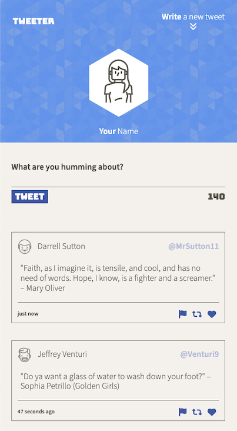

# Tweeter Project

Tweeter is a simple, single-page Twitter clone.

Tweeter is powered by Node and Express on the back-end. On the front-end, HTML, CSS, JS, jQuery and AJAX give this page a dynamic and fluid experience without any need to refresh or load a new page, giving the application a modern and clean UI.

## Preview
**Resizing demo:**

**Ultrawide monitor view:**

**Desktop view:**

**Mobile view:**

_Below 1024px, UI adjusts for tablets & mobile screens._

## Getting Started

1. [Create](https://docs.github.com/en/repositories/creating-and-managing-repositories/creating-a-repository-from-a-template) a new repository using this repository as a template.
2. Clone your repository onto your local device.
3. Install dependencies using the `npm install` command.
3. Start the web server using the `npm run local` command. The app will be served at <http://localhost:8080/>.
4. Go to <http://localhost:8080/> in your browser.

## Dependencies

- Express
- Node 5.10.x or above
